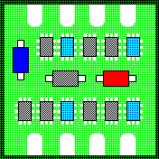

# PCB Binary Watchface

Another binary watchface showing time in a geeky way. The time can be read in the following way:

- the top row represents hours
- the bottom row represents minutes
- the LEDs have values: 32 (only minutes row), 16, 8, 4, 2, 1 from left to right 
- to read the time one has to add up the values of the "enlightened" LEDs
- the time on the left screenshots is 09:09(am)
- the time on the right screenshots is

Watchface written by [prefectAtEarth](https://www.github.com/prefectAtEarth/)

App icon [from Flaticons by Marz Gallery]("https://www.flaticon.com/free-icons/pcb-board")

